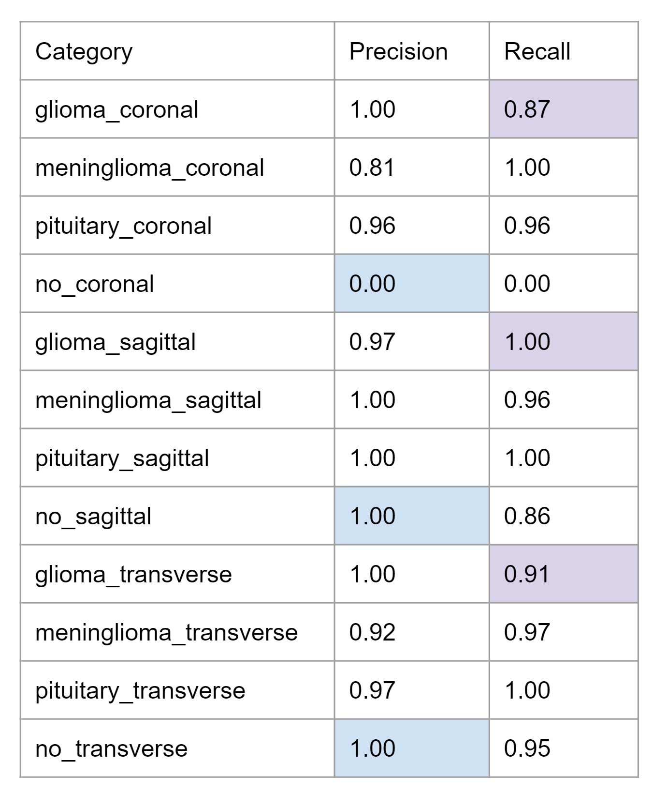

# erdos_artemis

Brain Tumor MRI Image Classification with Convolutional Neural Networks
=========================================================================

This convolutional neural network takes in MRI scans of the brain and spinal cord to detect the presence of tumors and classify their type. This was a project developed for the Erdos Institute Data Science Bootcamp, 2022, by the Artemis Group: Hakan Doga, Akarsh Mohan Konaje, Siying Li, and Erika Ordog.

Background
----------

Brain and spinal cord tumors are masses of abnormal cells in the brain or spinal cord that have grown out of control.
It is very important to distinguish between benign (non-cancerous) tumors and malignant (cancerous) tumors. 
MRI scans are considered the best way to look for tumors in these areas.

However, brain tumor diagnosis requires manual examination of MRI images by a radiologist. 
This process can be error-prone and time-consuming. 

The goal of this project is to improve the speed and accuracy of identifying and classifying brain tumors in MRI scans, which can facilitate the diagnostic process for healthcare provides and help patients receive faster and more accurate treatment.

Data
-------

The data was sourced from Kaggle (https://www.kaggle.com/datasets/sartajbhuvaji/brain-tumor-classification-mri).
This dataset contains approximately 400 MRI scans, which we separated into twelve categories based on the tumor type (glioma, meningioma, pituitary, or none) and the plane of the anatomical coordinate system on which the MRI image was taken (coronal, sagittal, or transverse).

The anatomical coordinate system                                                   |  MRI examples
:---------------------------------------------------------------------------------:|:--------------------------------------------------------------------:
  |  

The Baseline Model
----------------------

Our baseline model is a convolutional neural network with five convolutional layers and three dense layers.
It uses the sigmoid activation functions, which performed better than ReLU.

The MobileNetV2 Model
--------------------------

Since we have limited data, it is hard to get an accurate model training a convolutional neural network from scratch. 
For this reason, we applied transfer learning, using pre-trained weights from the MobileNetV2 model.
We added a global average pooling layer and randomly dropped out 50% of the neurons to prevent overfitting. 
The MobileNetV2 model was chosen because this architecture tends to perform well on mobile devices with limited storage, memory and computing power. 
Specifically, it requires fewer parameters, has relatively high accuracy on the ImageNet dataset, and is faster than all other deep learning models with pre-trained weights on Keras.
This model uses the softmax activation function and splits the data into 90% training, 10% testing, and further splits 10% of the training data into a validation set.

Results
---------------

On the testing set, the accuracies of the models are as follows: Baseline--88%, InceptionV3--94%, and MobileNetV2--95%.

The precision and recall for the MobileNetV2 model are displayed in the table below.

