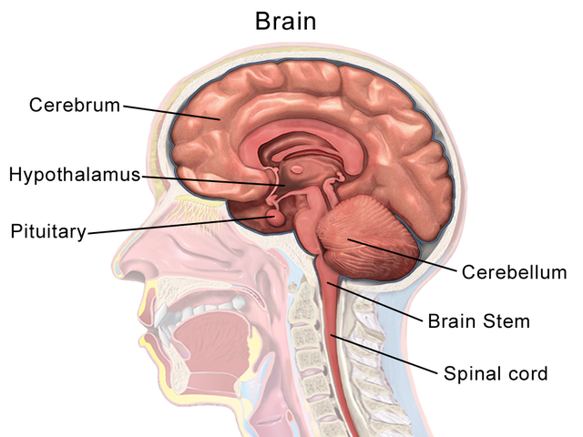
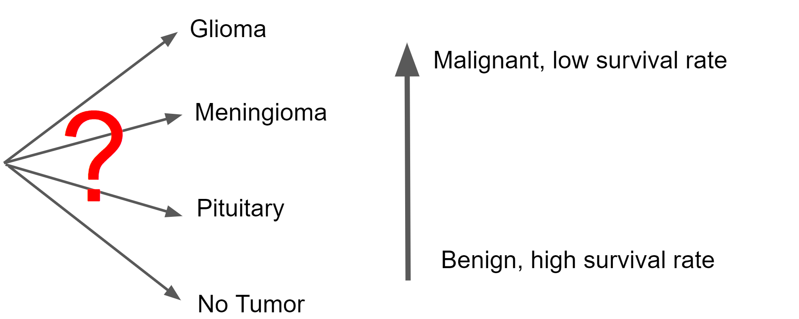
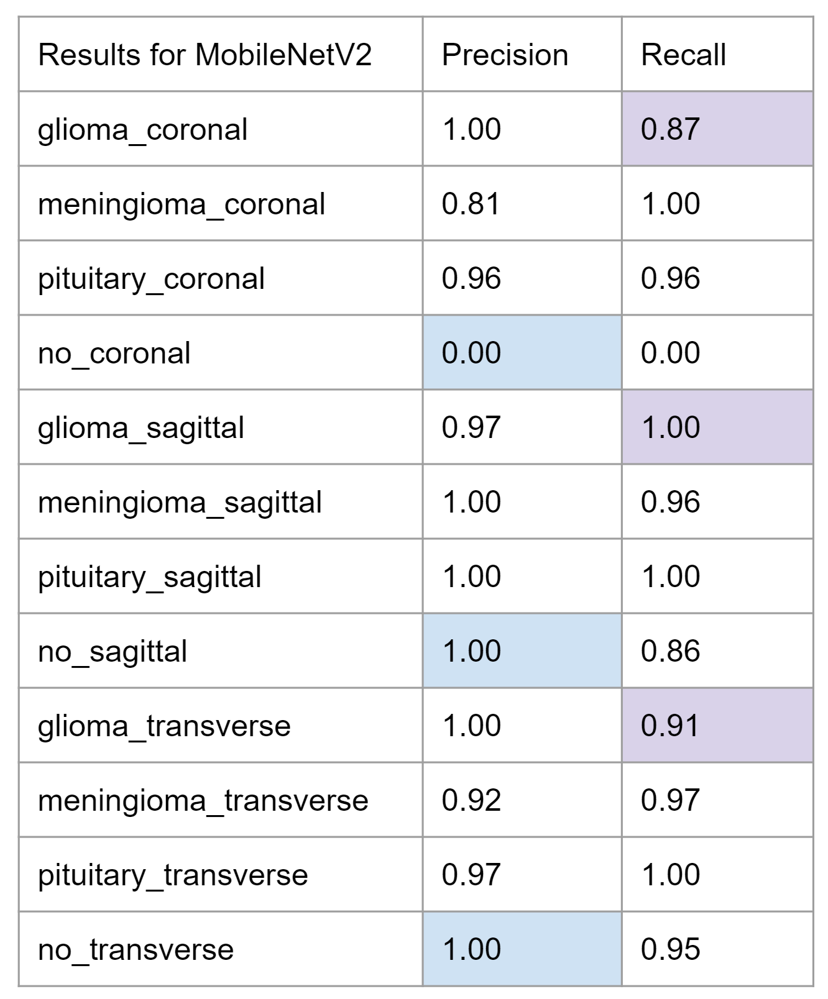

# erdos_artemis

Brain Tumor MRI Image Classification with Convolutional Neural Networks
=========================================================================

This convolutional neural network takes in MRI scans of the brain and spinal cord to detect the presence of tumors and classify their type. This was a project developed for the Erdos Institute Data Science Bootcamp, 2022, by the Artemis Group: Hakan Doga, Akarsh Mohan Konaje, Siying Li, and Erika Ordog.

Background
----------

Brain and spinal cord tumors are masses of abnormal cells in the brain or spinal cord that have grown out of control.
It is important to distinguish between benign (non-cancerous) tumors and malignant (cancerous) tumors. 
MRI scans are considered the best way to look for tumors in these areas.

However, brain tumor diagnosis requires manual examination of MRI images by a radiologist. 
This process can be error-prone, and in some regions, the lack of access to experts in the field can make it time-consuming to generate reports from the MRI. 

The goal of this project is to improve the speed and accuracy of identifying and classifying brain tumors in MRI scans, which can facilitate the diagnostic process for healthcare provides and help patients receive faster and more accurate treatment.

  
   

https://commons.wikimedia.org/wiki/File:Brain_Anatomy_(Sagittal).png

Data
-------

The data was sourced from Kaggle (https://www.kaggle.com/datasets/sartajbhuvaji/brain-tumor-classification-mri).
This dataset contains approximately 3200 MRI scans, which we separated into twelve categories based on the tumor type (glioma, meningioma, pituitary, or none) and the plane of the anatomical coordinate system on which the MRI image was taken (coronal, sagittal, or transverse).

The anatomical coordinate system                                                   |  MRI examples
:---------------------------------------------------------------------------------:|:--------------------------------------------------------------------:
  |  
http://en.wikipedia.org/wiki/File:Human_anatomy_planes.svg                         |

The Baseline Model
----------------------

Our baseline model is a convolutional neural network with five convolutional layers and three dense layers.
It uses the sigmoid activation function, which performed better than ReLU.

The MobileNetV2 Model
--------------------------

It is difficult to train an accurate CNN model with limited amount of data. And even with large datasets, it may take days or even weeks to train a CNN model. Therefore, we applied the concept of transfer learning to this project. Here, we used pre-trained weights of the MobileNetV2 model on the ImageNet dataset to train our brain tumor MRI image classification model. At the end of the model, we added a global average pooling layer and randomly dropped out 50% of the neurons to prevent overfitting. Softmax activation function was applied to generate the output layer. We chose the MobileNetV2 model over all other pre-built CNN architecture on Keras because it has high accuracy, less parameters, and short inference time. Therefore, it performs well on mobile devices with limited storage, memory, and computing power. 

Results
---------------

Three models are given in this repository: the baseline model, and modified versions of InceptionV3 and MobileNetV2. 
On the testing set, the accuracies of the models are as follows: Baseline--88%, InceptionV3--94%, and MobileNetV2--95%.

The precision and recall for the MobileNetV2 model are displayed in the table below.

